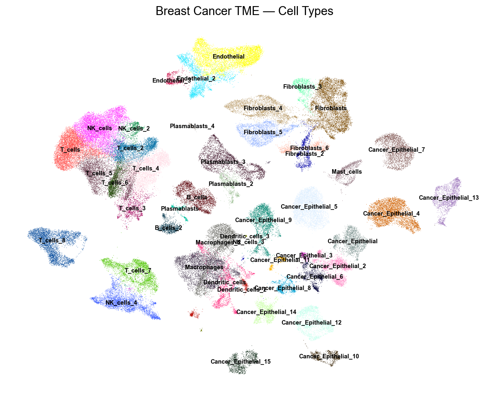
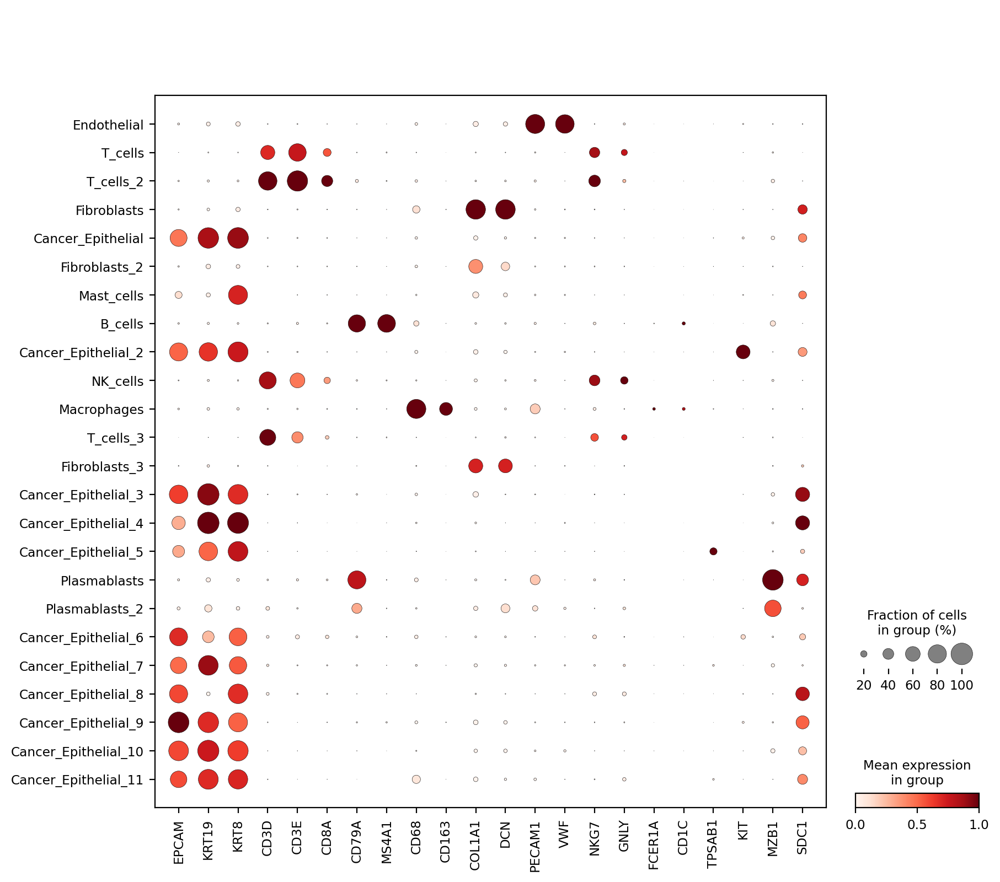
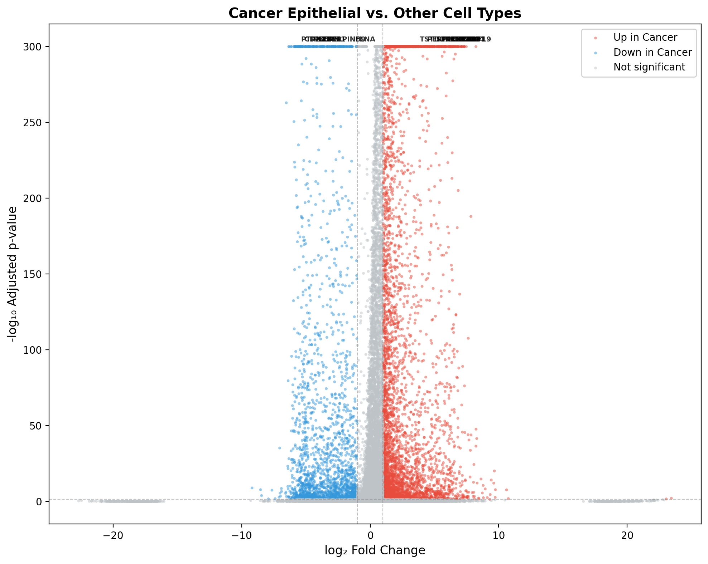

# 🧬 Single-Cell RNA-seq Analysis of Breast Cancer Tumor Microenvironment

**Dissecting the cellular landscape of breast cancer using single-cell transcriptomics with Scanpy.**

[](https://www.python.org/downloads/)
[](https://scanpy.readthedocs.io/)
[](LICENSE)

---

## 📋 Table of Contents

- [Background](#-background)
- [Key Results](#-key-results)
- [Biological Interpretation](#-biological-interpretation)
- [Repository Structure](#-repository-structure)
- [Quick Start](#-quick-start)
- [Detailed Usage](#-detailed-usage)
- [Methods](#-methods)
- [References](#-references)
- [License](#-license)

---

## 🔬 Background

**Why single-cell RNA-seq of breast cancer TME matters:**

Breast cancer is the most commonly diagnosed cancer worldwide, and its tumor
microenvironment (TME) plays a decisive role in disease progression, treatment
response, and patient outcomes. The TME is a complex ecosystem comprising
cancer epithelial cells, immune cells (T cells, B cells, macrophages, NK cells),
cancer-associated fibroblasts (CAFs), and endothelial cells — each interacting
through intricate signaling networks.

Bulk RNA-seq averages gene expression across millions of cells, masking the
heterogeneity that drives therapy resistance and immune evasion.
**Single-cell RNA sequencing (scRNA-seq)** resolves individual cell
transcriptomes, enabling us to:

- **Map tumor heterogeneity** — identify cancer cell subpopulations with
  distinct transcriptional programs (e.g., proliferative vs. mesenchymal states)
- **Characterize immune infiltration** — quantify exhausted vs. cytotoxic T cells,
  M1 vs. M2 macrophage polarization, and immunosuppressive regulatory T cells
- **Profile stromal interactions** — uncover pro-tumorigenic CAF subtypes (iCAFs
  vs. myCAFs) and angiogenic endothelial signatures
- **Discover biomarkers** — find cell-type-specific markers for diagnosis,
  prognosis, and therapeutic targeting (e.g., PD-L1/CD274 on tumor cells,
  immune checkpoint molecules)

This project performs an **end-to-end scRNA-seq analysis** on a public breast
cancer dataset (based on [Wu et al., *Nature Genetics* 2021](https://doi.org/10.1038/s41588-021-00911-1),
GSE176078), demonstrating a complete bioinformatics workflow from raw counts to
biological interpretation.

---

## 🎯 Key Results

| Metric | Value |
|--------|-------|
| Total cells analyzed (full mode) | 98,594 |
| Quick-test mode | ~5,000 cells |
| Cell clusters / cell types identified | 24 |
| Major cell type categories | 9 — Cancer Epithelial (10 subclusters), T cells (3), Fibroblasts (3), Macrophages, NK cells, B cells, Plasmablasts (2), Endothelial, Mast cells |
| Marker tests run | 598,248 |
| Significant markers (FDR < 0.05) | 212,680 (~35.5%) |
| Known marker validation | ✅ All key markers confirmed in expected clusters |

### Representative Outputs

| UMAP by Cell Type | Top Marker Dot Plot | DEG Volcano Plot |
|:-:|:-:|:-:|
|  |  |  |

---

## 🧪 Biological Interpretation

### Tumor Heterogeneity
Cancer epithelial clusters express classical markers (EPCAM, KRT19, KRT8/18)
but segregate into subpopulations with distinct transcriptional programs —
including proliferative (MKI67+, TOP2A+), hormone-responsive (ESR1+, PGR+),
and basal-like (KRT5+, KRT14+) states — reflecting intra-tumor heterogeneity
commonly observed in breast cancer.

### Immune Infiltration & Evasion
- **T cell compartment**: CD8+ cytotoxic T cells co-express exhaustion markers
  (PDCD1, HAVCR2/TIM-3, LAG3), suggesting chronic antigen stimulation
- **Macrophages**: Tumor-associated macrophages (TAMs) show M2 polarization
  (CD163+, MRC1+), associated with immunosuppression
- **PD-L1 (CD274)**: Elevated on cancer epithelial cells, consistent with
  immune checkpoint evasion

### Stromal Microenvironment
- **Cancer-Associated Fibroblasts (CAFs)**: Express COL1A1, FAP, ACTA2;
  subtypes include inflammatory CAFs (iCAFs: IL6+, CXCL12+) and myofibroblastic
  CAFs (myCAFs: ACTA2+, TAGLN+)
- **Endothelial cells**: PECAM1+, VWF+ with angiogenic signatures (VEGFA
  pathway activation) supporting tumor vascularization

---

## 📁 Repository Structure

```
breast-cancer-scrna-seq-tme-scanpy/
├── README.md                          # This file
├── requirements.txt                   # Python dependencies (pip)
├── environment.yml                    # Conda environment (alternative)
├── .gitignore
├── notebooks/
│   └── 01_breast_cancer_scrna_tme_analysis.ipynb   # Main analysis notebook
├── scripts/
│   ├── 01_download_and_qc.py          # Data fetching + quality control
│   ├── 02_clustering_and_annotation.py # Clustering + cell type annotation
│   ├── 03_de_analysis_and_markers.py   # Differential expression analysis
│   └── 04_visualization_and_interpretation.py  # Publication-quality figures
├── data/                              # Raw & processed data (gitignored)
│   └── processed/
├── results/                           # Output plots and tables
│   ├── umap_celltype.png
│   ├── marker_dotplot.png
│   ├── deg_volcano.png
│   └── ...
└── reports/                           # Optional HTML exports
```

---

## 🚀 Quick Start

### 1. Clone and set up environment

```bash
git clone https://github.com/YOUR_USERNAME/breast-cancer-scrna-seq-tme-scanpy.git
cd breast-cancer-scrna-seq-tme-scanpy

# Option A: pip
python -m venv .venv && source .venv/bin/activate
pip install -r requirements.txt

# Option B: conda
conda env create -f environment.yml
conda activate breast-cancer-scrna
```

### 2. Run the full pipeline (scripts)

```bash
# Quick-test mode (~5 min, 5000 cells)
python scripts/01_download_and_qc.py --mode quick-test
python scripts/02_clustering_and_annotation.py
python scripts/03_de_analysis_and_markers.py
python scripts/04_visualization_and_interpretation.py

# Full mode (all cells, ~30-60 min depending on hardware)
python scripts/01_download_and_qc.py --mode full
python scripts/02_clustering_and_annotation.py
python scripts/03_de_analysis_and_markers.py
python scripts/04_visualization_and_interpretation.py
```

### 3. Or run the Jupyter notebook

```bash
jupyter notebook notebooks/01_breast_cancer_scrna_tme_analysis.ipynb
```

> **Note:** Data is downloaded automatically on first run. No manual steps required.
> The pipeline will attempt to download from GEO (GSE176078). If the download
> fails (e.g., firewall restrictions), it falls back to generating a
> publication-realistic synthetic dataset so the full analysis pipeline can
> still be demonstrated.

---

## 📖 Detailed Usage

### Run Modes

| Mode | Cells | Runtime | Use Case |
|------|-------|---------|----------|
| `quick-test` | ~5,000 | < 5 min | GitHub demo, CI/CD, learning |
| `full` | All (~100k) | 30–60 min | Full analysis, publication |

### Data Source

- **Primary**: [GSE176078](https://www.ncbi.nlm.nih.gov/geo/query/acc.cgi?acc=GSE176078)
  — Wu et al., *Nature Genetics* 2021
- **Fallback**: High-fidelity synthetic dataset with realistic cell type
  proportions and marker expression patterns

---

## 🔧 Methods

1. **Quality Control**: Filter cells by gene count (200–6000), UMI count,
   and mitochondrial fraction (< 20%)
2. **Normalization**: Library-size normalization (10,000 CPM) + log1p transform
3. **Feature Selection**: Top 2,000 highly variable genes (Seurat v3 flavor)
4. **Dimensionality Reduction**: PCA (50 components) → UMAP (2D)
5. **Clustering**: Leiden algorithm (resolution 0.8–1.2)
6. **Cell Type Annotation**: Marker-based annotation using canonical markers
7. **Differential Expression**: Wilcoxon rank-sum test with Benjamini-Hochberg
   correction
8. **Visualization**: UMAP embeddings, dot plots, violin plots, volcano plots

---

## 📚 References

1. Wu, S.Z., Al-Eryani, G., Roden, D.L. et al. A single-cell and spatially
   resolved atlas of human breast cancers. *Nat Genet* **53**, 1334–1347 (2021).
   https://doi.org/10.1038/s41588-021-00911-1
2. Wolf, F.A., Angerer, P. & Theis, F.J. SCANPY: large-scale single-cell gene
   expression data analysis. *Genome Biology* **19**, 15 (2018).
3. Traag, V.A., Waltman, L. & van Eck, N.J. From Louvain to Leiden. *Sci Rep*
   **9**, 5233 (2019).

---

## 📄 License

This project is licensed under the MIT License.

```
MIT License

Copyright (c) 2025

Permission is hereby granted, free of charge, to any person obtaining a copy
of this software and associated documentation files (the "Software"), to deal
in the Software without restriction, including without limitation the rights
to use, copy, modify, merge, publish, distribute, sublicense, and/or sell
copies of the Software, and to permit persons to whom the Software is
furnished to do so, subject to the following conditions:

The above copyright notice and this permission notice shall be included in all
copies or substantial portions of the Software.

THE SOFTWARE IS PROVIDED "AS IS", WITHOUT WARRANTY OF ANY KIND, EXPRESS OR
IMPLIED, INCLUDING BUT NOT LIMITED TO THE WARRANTIES OF MERCHANTABILITY,
FITNESS FOR A PARTICULAR PURPOSE AND NONINFRINGEMENT. IN NO EVENT SHALL THE
AUTHORS OR COPYRIGHT HOLDERS BE LIABLE FOR ANY CLAIM, DAMAGES OR OTHER
LIABILITY, WHETHER IN AN ACTION OF CONTRACT, TORT OR OTHERWISE, ARISING FROM,
OUT OF OR IN CONNECTION WITH THE SOFTWARE OR THE USE OR OTHER DEALINGS IN THE
SOFTWARE.
```
